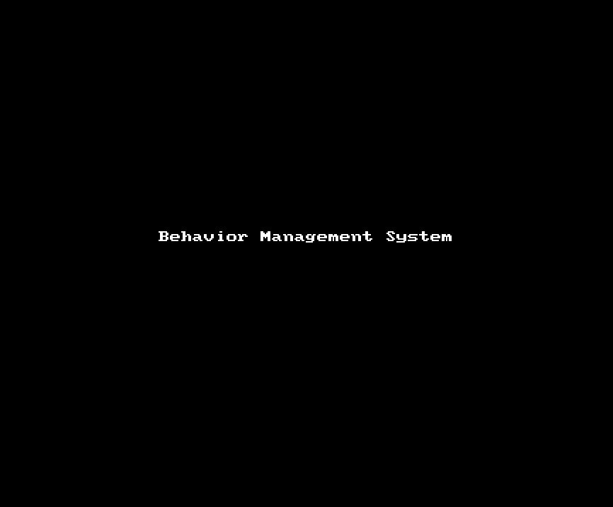

[](https://github.com/tterb/atomic-design-ui/blob/master/LICENSEs)
# Behavior Management
The behavior Management App is intended for use in a classroom. When a teacher is delivering a lesson and a student interrupts in the middle of it, sometimes it is for a good reason, but sometimes it is not. Most of the time is just about bad behavior and that situation needs to be addressed. This app fills the gap between the bad behavior in the classroom and the records of actions taken to correct it. If a student is not behaving correctly, the teacher marks the type of behavior in the app, a description note, and the day that it happened. Later, the teacher or an administratior in the school can bring a report of incidents and update the actions taken to improve that student's behavior.  

## Table of Contents
- Behavior Management
  * [Usage](#usage)
  * [Credits](#credits)
  * [Useful Websites](#useful-websites)
  * [Current Features](#current-features)
  * [Future Features](#future-features)
  * [Contributions](#contributions)
- [🔗 Links](#---links)
    + [GitHub Repository](#github-repository)
    + [Live Link](#live-link)
    + [Support](#support)
    + [Authors](#authors)

## Usage
This app is mobile-ready and very easy to use, just follow the steps!
``````
- Login using your credentials
- Select your classroom
- Select a student you want to create a note
- Write the note and press save.
- Later, select the student again and create a note about the actions taken to correct the behavior.
``````


## Credits
This project is team effort. The team members are:
- Tommy Kang [https://github.com/tommy1krr](https://github.com/tommy1krr) 
- Brian O'Connor [https://github.com/boconnorb20](https://github.com/boconnorb20) 
- Robert Hare [https://github.com/Hare-Ball](https://github.com/Hare-Ball) 
- Gianni Fontanot [https://github.com/giannifontanot](https://github.com/giannifontanot) 


## Useful Websites
 - [When to Use Map instead of Plain JavaScript Object](https://dmitripavlutin.com/maps-vs-plain-objects-javascript/) 
 - [Four Sequelize Associations You Should Know](https://javascript.plainenglish.io/four-sequelize-associations-you-should-know-415d8d413e1e) 
 - [A Complete Guide to Flexbox](https://css-tricks.com/snippets/css/a-guide-to-flexbox/) 
 - [Integrating Google Sign-In into your web app](https://developers.google.com/identity/sign-in/web/sign-in)
 
## Current Features
````````````````````````
- This app helps teacher mantain a record of behavior in the classroom
- It records the behavior and the actions taken to correct it
- The screens are mobile-ready, so the teacher can simple use his/her phone
- It has a clean user interface
````````````````````````
## Future Features
````````````````````````
- Create screens for update teacher or new student
- Create screens for student assigned to classroom
- Have an option to change the theme of the app
````````````````````````
## Contributions
If you would like to contribute to this project , you are very welcome! You can fork it and later submit a pull request. 
In case you need them, here are some guidelines: [Contributor Covenant](https://www.contributor-covenant.org/)
# 🔗 Links
### GitHub Repository
[https://github.com/Hare-Ball/BehavioRepo/](https://github.com/Hare-Ball/BehavioRepo/)
### Live Link
[https://behavior-management-system.herokuapp.com/](https://behavior-management-system.herokuapp.com/)
### Support
If you need help with this project, please write to: [Robert Hare](https://www.linkedin.com/in/robert-hare-b2b87441/)
### Authors
 - [@Tommy Kang](https://github.com/tommy1krr) 
 - [@Brian O'Connor](https://github.com/boconnorb20) 
 - [@Robert Hare](https://github.com/Hare-Ball) 
 - [@giannifontanot](https://www.github.com/giannifontanot)
